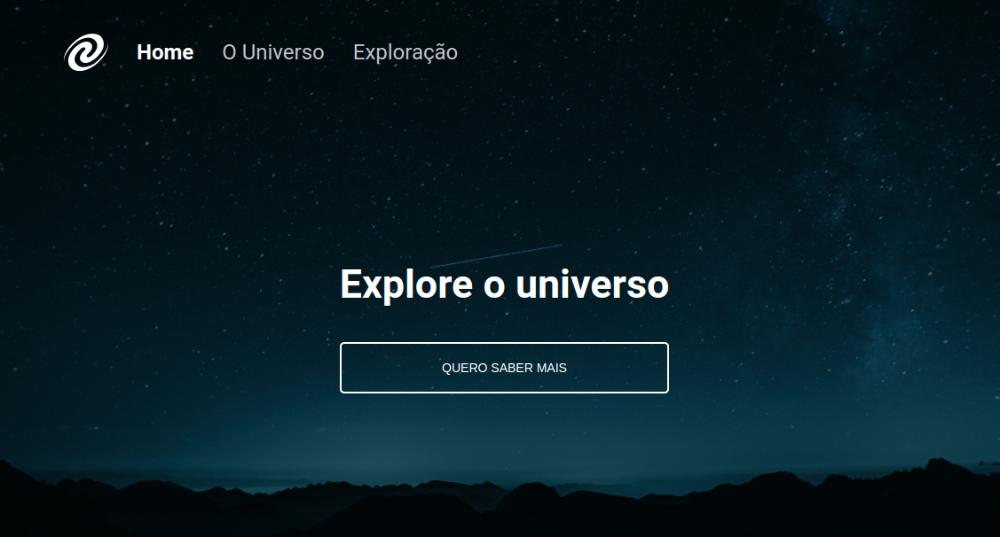

# SPA Universe

O SPA Universe é um projeto desenvolvido no treinamento web [rocketseat](https://www.rocketseat.com.br/)

<p align="center">
    
</p>


## Início Rápido

```bash
git@github.com:dekemvrios/spa-universe.git
cd spa-universe
npx serve
```

## Contribuições

Refira-se ao guia de [contribuições](./docs/CONTRIBUTING.md) para detalhes de como contribuir para o projeto.

## Licença

Este projeto considera a licença MIT.

[project-link]: https://github.com/realfabecker/focus-timer-02